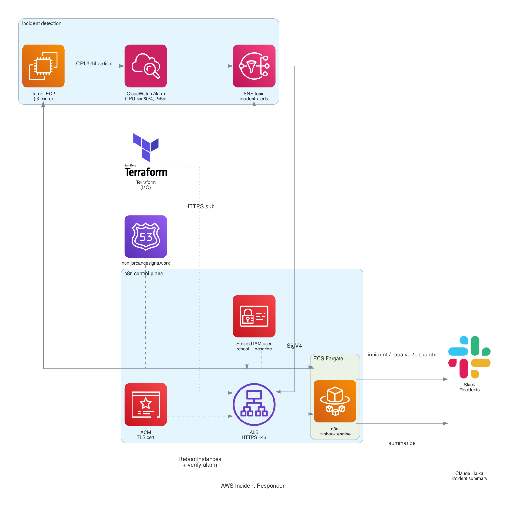

# AWS Incident Responder

An automated incident response pipeline where the runbook is an n8n workflow, not glue code. A CloudWatch alarm on a target EC2 instance fires into an SNS topic, which delivers over HTTPS to n8n running on ECS Fargate. The workflow confirms its own SNS subscription, asks Claude Haiku for a plain-English incident summary, posts an incident card to Slack, reboots the instance, then waits and re-checks the alarm to decide whether to mark the incident resolved or escalate.

## Architecture



## How it works

```
Target EC2  CPUUtilization >= 80% (2 x 5 min)
  -> CloudWatch Alarm
    -> SNS topic (incident-alerts)
      -> HTTPS subscription
        -> ALB (ACM TLS, n8n.jordandesigns.io)
          -> n8n on ECS Fargate

n8n runbook:
  confirm SNS subscription
  -> parse alarm
  -> Claude Haiku incident summary
  -> Slack incident card
  -> EC2 RebootInstances (SigV4)
  -> wait 60s
  -> DescribeAlarms
  -> resolved  -> Slack resolved
     not yet   -> Slack escalate
```

## Why n8n instead of Lambda

This is the deliberate contrast to the sibling [event-driven-aws-remediation](https://github.com/jordann6/event-driven-aws-remediation) project, which uses a Python Lambda as the glue between alarm and action. Here the same incident class is handled by a visual, auditable runbook running as a real service on AWS. The runbook is version controlled as JSON, the remediation steps are inspectable without reading code, and adding a step (enrichment, an approval gate, a second remediation) is a node rather than a redeploy. Claude Haiku adds a human-readable summary so the Slack card reads like an on-call note rather than a raw alarm payload.

## Components

| Layer | Resource | Role |
|---|---|---|
| Detection | **EC2 target** (t3.micro, AL2023) | Demo workload; ships a self-contained CPU-burn unit and an SSM instance role so it is reachable via Session Manager |
| Detection | **CloudWatch alarm** | `CPUUtilization >= 80%`, 2 evaluation periods of 5 minutes |
| Routing | **SNS topic** | Fans the alarm state change out to the n8n HTTPS endpoint |
| Control plane | **ALB + ACM** | Publicly trusted TLS so SNS accepts the HTTPS subscription |
| Control plane | **ECS Fargate** | Runs `n8nio/n8n`, the runbook engine; tasks accept traffic only from the ALB (SG-restricted) |
| Runbook | **Claude Haiku** | Generates the incident summary and recommended next step |
| Runbook | **Slack** | Incident, resolved, and escalation messages to `#incidents` |
| Remediation | **Scoped IAM user** | `ec2:RebootInstances` on the target only, plus read-only enrichment |
| IaC | **Terraform** | VPC, ALB, ECS, alarm, SNS, IAM, DNS; S3 remote state |

## Prerequisites

- Terraform >= 1.6, AWS CLI configured for account `692859913278`
- The S3 state backend bucket `tf-backend-jord-projs`
- A public Route 53 hosted zone for `jordandesigns.io` (the registrar-delegated zone)
- An Anthropic API key and a Slack bot token with `chat:write`

## Deploy

Secrets are kept out of Terraform state. Create the n8n SSM parameters first:

```bash
aws ssm put-parameter --name /incident-responder/n8n-basic-auth-password \
  --type SecureString --value "$(openssl rand -base64 18)"
aws ssm put-parameter --name /incident-responder/n8n-encryption-key \
  --type SecureString --value "$(openssl rand -hex 24)"
```

Then provision the infrastructure:

```bash
cd terraform
terraform init
terraform apply
```

Note the outputs (`n8n_url`, `n8n_webhook_endpoint`, `target_instance_id`, `alarm_name`, `n8n_iam_user`).

### Configure n8n

1. Open `n8n_url`, log in with the basic auth user (`admin`) and the SSM password.
2. Import `workflows/incident-responder.json`.
3. Create an access key for the scoped IAM user and add it as the workflow's AWS credential:
   ```bash
   aws iam create-access-key --user-name incident-responder-n8n
   ```
4. Add the Anthropic credential as HTTP Header Auth: header `x-api-key`, value = your API key.
5. Add the Slack credential (bot token) and confirm the bot is in `#incidents`.
6. Activate the workflow.

### Connect SNS to the live workflow

The SNS subscription is gated behind `enable_sns_subscription` (default `false`) because SNS rejects an unreachable endpoint at subscribe time, which would fail the first apply before n8n is serving the webhook. Once the workflow is imported and active, enable it so SNS delivers the confirmation to a live endpoint that n8n auto-confirms:

```bash
terraform apply -var="enable_sns_subscription=true"
```

Confirm it moved out of `PendingConfirmation`:

```bash
aws sns list-subscriptions-by-topic --topic-arn "$(terraform output -raw sns_topic_arn)" \
  --query 'Subscriptions[].SubscriptionArn'
```

## Validate

Drive CPU on the target so the alarm trips (the target has an SSM role, so Session Manager works with no inbound access; requires the `session-manager-plugin` locally):

```bash
aws ssm start-session --target "$(terraform output -raw target_instance_id)"
sudo systemctl start incident-stress   # burns every vCPU for 10 minutes
```

Within two evaluation periods the alarm enters ALARM and the runbook runs end to end. Confirm:

- Slack `#incidents` shows the incident card with the Haiku summary, then a resolved or escalation message.
- The n8n execution log shows the full path including the reboot and DescribeAlarms steps.
- The target instance shows a recent reboot in its system log.

## Destroy

```bash
cd terraform
terraform destroy
aws ssm delete-parameter --name /incident-responder/n8n-basic-auth-password
aws ssm delete-parameter --name /incident-responder/n8n-encryption-key
```

Teardown is clean. The ALB and its ENIs can take a minute to deregister, so a destroy retry occasionally clears a lingering ENI dependency. Confirm the SNS subscription and the IAM access key are gone afterward.

## Cost

About `$0.05/hour` while running (ALB, one 0.25 vCPU Fargate task, one t3.micro), roughly `$1/day`. Built to deploy, demo, and destroy the same day for well under a dollar. ACM and the existing hosted zone add nothing.

## Hardening notes

- In production the ECS task role would carry the remediation permissions directly so no IAM-user access key is needed; the scoped user here keeps the n8n credential setup simple for a demo.
- n8n runs on SQLite on ephemeral Fargate storage. For persistence across task restarts, attach EFS or point n8n at RDS Postgres.
- Alarm effects are scoped to a single reboot; a production runbook would add an approval gate before destructive actions and a maximum retry budget before escalation.
